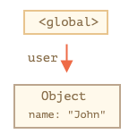
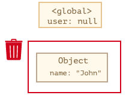
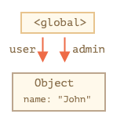
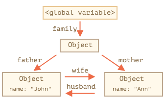
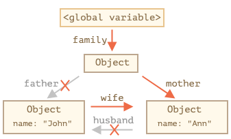
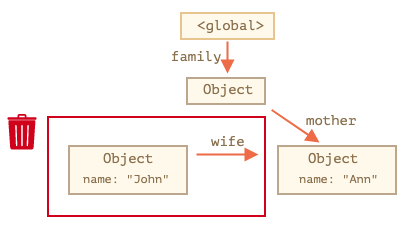
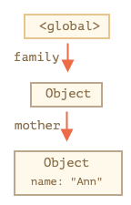
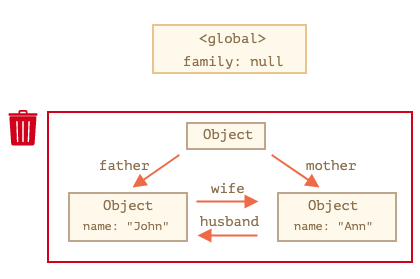
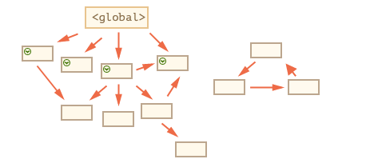
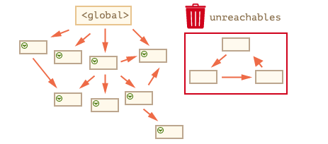

# Object trong Javascript
<details>
<summary><strong>1. Object trong JavaScript</strong></summary>

### 2.1 Object là gì?

* Object là **kiểu dữ liệu dạng tham chiếu** trong JavaScript, dùng để biểu diễn một vật thể cụ thể.
* Object là **tập hợp các cặp key-value**, trong đó:

  * **key**: tên thuộc tính (kiểu `string` hoặc `symbol`)
  * **value**: giá trị tương ứng (bất kỳ kiểu dữ liệu nào, kể cả object khác)

**Ví dụ:**

```js
let myComputer = {
  type: "laptop",
  brand: "Sony",
  os: "Windows 7",
  graphicCard: "NVIDIA",
};
```

* Object có thể **rỗng**:

```js
let emptyObj = {};
let anotherEmpty = new Object(); // ít dùng
```

---

### 2.2 Truy cập và cập nhật thuộc tính

**Cách truy cập:**

1. Toán tử chấm `.`
2. Toán tử ngoặc vuông `[]` (phù hợp với key có dấu cách, ký tự đặc biệt, hoặc key runtime)

```js
console.log(myComputer.type); // laptop
console.log(myComputer["operating system"]); // Windows 7
```

**Cập nhật thuộc tính:**

```js
myComputer.type = "desktop";
myComputer["operating system"] = "Ubuntu";
```

**Thêm thuộc tính mới:**

```js
myComputer.status = "sleep";
myComputer["it is good"] = true;
```

**Xóa thuộc tính:**

```js
delete myComputer.brand;
delete myComputer["graphic card"];
```

---

### 2.3 Toán tử \[] linh hoạt

* Cho phép **key là biến hoặc biểu thức**:

```js
let t = "type";
let osKey = "operating system";

let myComputer = {
  [t]: "laptop",
  brand: "Sony",
  [osKey]: "Windows 7",
  ["graphic" + " " + "card"]: "NVIDIA",
};
```

* Truy cập:

```js
console.log(myComputer.type); // "laptop"
console.log(myComputer["operating system"]); // "Windows 7"
```

---

### 2.4 Cú pháp rút gọn khi tạo object

```js
function makeComputer(type, brand, os, graphicCard) {
  return { type, brand, os, graphicCard };
}

let myComputer = makeComputer("laptop", "Sony", "Windows 7", "NVIDIA");
```

---

### 2.5 Kiểm tra tính tồn tại của thuộc tính

* **Truy cập trực tiếp** không đáng tin khi giá trị là `undefined`.
* Sử dụng toán tử `in`:

```js
let user = { name: undefined };
console.log("name" in user); // true
console.log("age" in user); // false
```

---

### 2.6 Duyệt tất cả các thuộc tính

```js
for (let prop in myComputer) {
  console.log(prop, ":", myComputer[prop]);
}
```

* **Thứ tự:**

  * Thuộc tính số nguyên: tăng dần
  * Thuộc tính còn lại: theo thứ tự thêm vào object

---

### 2.7 Một số object sẵn có

* `arguments`: chứa tất cả tham số truyền vào hàm
* `Math`: cung cấp các hàm toán học như `Math.min`, `Math.max`, `Math.sqrt`, `Math.abs`
* `window` (trên trình duyệt): object toàn cục, biến global thuộc object này

---

### 2.8 Thực hành

```js
// 1. Tạo object rỗng `point`.
let point = {};

// 2. Thêm thuộc tính `x` với giá trị `2`.
point.x = 2;

// 3. Thêm thuộc tính `y` với giá trị `3`.
point.y = 3;

// 4. Thêm thuộc tính `z index` với giá trị `1000`.
point["z-index"] = 1000;

// 5. Tính tổng giá trị các thuộc tính.
let sum = 0;
for (let key in point) {
  sum += point[key];
}
console.log(sum); // 1005

// 6. Thay đổi giá trị thuộc tính `x` thành `1`.
point.x = 1;

// 7. Xóa thuộc tính `y`.
delete point.y;
```

</details>
<details>
<summary><strong>2. So sánh hai Object trong JavaScript</strong></summary>

### Kiểu dữ liệu tham chiếu

* Object lưu trữ **theo địa chỉ trong bộ nhớ**.
* Khi gán object này cho biến khác, biến mới **tham chiếu đến cùng một địa chỉ**, không tạo bản sao.

```js
let p1 = { x: 1, y: 2 };
let p2 = p1;

p2.x = 2;
console.log(p1.x); // 2
console.log(p2.x); // 2
```

---

### So sánh object bằng tham chiếu

* Sử dụng `==`, `===` hoặc `Object.is`:

  * Hai object **bằng nhau** khi cùng trỏ đến **cùng địa chỉ bộ nhớ**.

```js
let x = {};
let y = x;       // cùng tham chiếu
let z = {};      // object độc lập

console.log(y === x); // true
console.log(z === x); // false
console.log(Object.is(y, x)); // true
console.log(Object.is(z, x)); // false
```

---

### So sánh object theo giá trị (thủ công)

* So sánh từng thuộc tính:

```js
let point1 = { x: 1, y: 2 };
let point2 = { x: 1, y: 2 };

function isPointEqual(p1, p2) {
  return p1.x === p2.x && p1.y === p2.y;
}

console.log(isPointEqual(point1, point2)); // true
```

* Nếu object có nhiều thuộc tính hoặc số lượng không biết trước, dùng **vòng lặp `for...in`**:

```js
function isShallowEqual(obj1, obj2) {
  for (let prop in obj1) {
    if (obj1[prop] !== obj2[prop]) return false;
  }
  for (let prop in obj2) {
    if (obj2[prop] !== obj1[prop]) return false;
  }
  return true;
}

let point1 = { x: 1, y: 2 };
let point2 = { x: 1, y: 2 };
console.log(isShallowEqual(point1, point2)); // true
```

* **Lưu ý:** So sánh nông **không áp dụng được với giá trị kiểu object** (lồng nhau):

```js
let point1 = { x: 1, y: 2, metadata: { type: "point" } };
let point2 = { x: 1, y: 2, metadata: { type: "point" } };

console.log(isShallowEqual(point1, point2)); // false
```

---

### So sánh sâu (Deep Equality)

* Duyệt tất cả các thuộc tính **đệ quy** để so sánh các object lồng nhau.
* Trong thực tế, có thể dùng thư viện như **Lodash**: `_.isEqual(obj1, obj2)` để so sánh an toàn.

---

### Tổng kết

Các cách so sánh object trong JavaScript:

1. **So sánh bằng tham chiếu:** `==`, `===`, `Object.is`
2. **So sánh thủ công theo giá trị:** so sánh từng thuộc tính
3. **So sánh nông (Shallow equality):** duyệt một cấp thuộc tính
4. **So sánh sâu (Deep equality):** duyệt tất cả cấp thuộc tính (dùng đệ quy hoặc thư viện)

</details>
<details>
<summary><strong>3. Copy Object trong JavaScript</strong></summary>

### Object là kiểu dữ liệu tham chiếu

* Khi gán object này cho biến khác, thực chất **chỉ copy địa chỉ bộ nhớ**, không tạo bản sao.

```js
let p1 = { x: 1, y: 2 };
let p2 = p1;

p2.x = 5;
console.log(p1.x); // 5
console.log(p2.x); // 5
```

---

### 1. Copy object bằng vòng lặp `for...in`

* Duyệt tất cả các thuộc tính và gán giá trị sang object mới.

```js
let p1 = { x: 1, y: 2 };
let p2 = {};
for (let key in p1) {
  p2[key] = p1[key];
}

p2.x = 5;
console.log(p1.x); // 1
console.log(p2.x); // 5
```

---

### 2. Copy nông (Shallow copy) với `Object.assign()` hoặc spread `...`

* **Cú pháp Object.assign**:

```js
Object.assign(dest, src1, src2, ...);
```

* Ví dụ:

```js
let user = { name: "Alex" };
let permission1 = { canView: true };
let permission2 = { canEdit: false };

Object.assign(user, permission1, permission2);
// user = { name: "Alex", canView: true, canEdit: false }
```

* **Cú pháp spread**:

```js
let p2 = { ...p1 };
```

* **Lưu ý:** Copy nông chỉ sao chép **một cấp**; nếu thuộc tính là object, vẫn cùng tham chiếu:

```js
let point1 = { x: 1, y: 2, metadata: { type: "point" } };
let point2 = Object.assign({}, point1);

point2.metadata.type = "CHANGED";
console.log(point1.metadata.type); // CHANGED
```

---

### 3. Copy sâu (Deep copy)

* Tạo object hoàn toàn độc lập, kể cả object lồng nhau.
* Dùng `JSON.stringify()` + `JSON.parse()`:

```js
let point1 = { x: 1, y: 2, metadata: { type: "point" } };
let point2 = JSON.parse(JSON.stringify(point1));

point2.metadata.type = "CHANGED";
console.log(point1.metadata.type); // point
console.log(point2.metadata.type); // CHANGED
```

* **Giới hạn:**

  * Không copy được các thuộc tính có giá trị là **hàm**.

```js
let point1 = { getDisplayName: () => "test" };
let point2 = JSON.parse(JSON.stringify(point1));
console.log(point2.getDisplayName); // undefined
```

* Giải pháp nâng cao: dùng thư viện như **Lodash**: `_.cloneDeep(value)`.

---

### Tổng kết

* Object là kiểu dữ liệu tham chiếu, copy thông thường là copy địa chỉ.
* **Các cách copy object độc lập:**

  1. Vòng lặp `for...in`
  2. `Object.assign()` hoặc spread `...` → copy nông
  3. `JSON.stringify()` + `JSON.parse()` hoặc `_.cloneDeep()` → copy sâu

</details>
<details>
<summary><strong>4. Garbage Collection trong JavaScript</strong></summary>

### 1. Khái niệm

* JavaScript quản lý bộ nhớ **tự động**.
* Khi một vùng nhớ **không còn sử dụng**, Garbage Collector (GC) sẽ **tự động giải phóng**.

---

### 2. Khả năng truy cập (Reachability)

* **Giá trị “có thể truy cập”**: có thể truy xuất từ **root**.
* **Root** bao gồm:

  * Biến toàn cục
  * Biến cục bộ trong hàm đang thực thi
  * Tham số hàm
  * Các hàm được gọi từ root
* **Garbage Collector** chỉ xóa các object **không thể truy cập từ root**.

#### Ví dụ đơn giản

```js
let user = { name: "John" };
user = null; // "John" không còn tham chiếu → GC sẽ xóa
```




#### Hai tham chiếu đến object

```js
let user = { name: "John" };
let admin = user;

user = null; 
// John vẫn có thể truy cập qua admin → không bị xóa
```



---

### 3. Object có liên kết nội bộ

* Object có thể tham chiếu lẫn nhau nhưng nếu **không có tham chiếu từ root**, toàn bộ nhóm object sẽ bị xóa.

```js
function marry(man, woman) {
  woman.husband = man;
  man.wife = woman;

  return { father: man, mother: woman };
}

let family = marry({ name: "John" }, { name: "Ann" });

```
Hàm `marry` đã móc nối hai object `man` và `woman` bằng cách để hai object tham chiếu đến lẫn nhau. Rồi trả về một object mới chứa cả hai object `man` và `woman`.

Kết quả thu được như sau:



Trong hình trên, tất cả các object đều là "có thể tiếp cận".

Bây giờ, mình xóa đi hai tham chiếu:
```js
delete family.father;
delete family.mother.husband;
```


Bạn thấy rằng, John không có tham chiếu nào đi đến. Nói cách khác là không thể truy cập đến John từ root. Do đó, vùng nhớ của John sẽ bị xóa.



Sau khi xóa vùng nhớ của John, kết quả còn lại là:



**Nhóm các object không thể tiếp cận**
Có trường hợp mà cả một nhóm các object là "không thể tiếp cận" và bị xóa khỏi bộ nhớ.

Ví dụ với object ban đầu, mình ghi đè giá trị của `family`:
```js
family = null;
```
Khi đó, bản đồ bộ nhớ sẽ như sau:



Mặc dù, John và Ann đều có tham chiếu nội bộ đến nhau. Thậm chí, John và Ann còn có tham chiếu đi đến. Nhưng như vậy là chưa đủ.

Vì quan trọng hơn cả, những object này lại không có tham chiếu từ root. Nên tất cả chúng đều "không thể tiếp cận".

Kết quả là nhóm các object này bị xóa khỏi bộ nhớ.

---

### 4. Thuật toán Garbage Collection

**Mark-and-Sweep (“đánh dấu và xóa”)**

1. Bắt đầu từ **root**, đánh dấu các object có thể truy cập.


2. Duyệt tất cả object được đánh dấu, tiếp tục đánh dấu các object tham chiếu từ nó.


3. Object không được đánh dấu → **không thể truy cập** → xóa khỏi bộ nhớ.



---

### 5. Tối ưu Garbage Collection

* **Generational Collection:** phân chia object thành “mới” và “cũ”, kiểm tra các object mới thường xuyên hơn.
* **Incremental Collection:** chia quá trình GC thành nhiều bước nhỏ, chạy song song với luồng chính.
* **Idle-time Collection:** GC chạy khi CPU rảnh rỗi để không ảnh hưởng hiệu năng.

---

### 6. Tổng kết

* Garbage Collection **tự động**, không cần can thiệp thủ công.
* Object tồn tại **cho đến khi không thể truy cập từ root**.
* Object có tham chiếu lẫn nhau nhưng không có root vẫn bị xóa.
* JavaScript Engine tối ưu GC để tránh ảnh hưởng đến hiệu năng.

</details>
<details>
<summary><strong>5. Phương thức trong JavaScript & từ khóa this</strong></summary>

### 1. Phương thức của Object

* **Hàm gán cho thuộc tính của object** gọi là **phương thức**.
* Ví dụ:

```js
let user = { name: "Alex", age: 28 };

// Function expression
user.sayHello = function() { console.log("Hello!"); };
user.sayHello(); // Hello!

// Function declaration
function sayHello() { console.log("Hello!"); }
user.sayHello = sayHello;
user.sayHello(); // Hello!
```

#### Cú pháp khai báo phương thức khi tạo object

```js
let user = {
  name: "Alex",
  age: 28,
  sayHello: function() { console.log("Hello!"); },
};

// Cú pháp ngắn gọn
let user = {
  name: "Alex",
  age: 28,
  sayHello() { console.log("Hello!"); },
};

user.sayHello(); // Hello!
```

---

### 2. Từ khóa `this` trong JavaScript

* `this` **là object gọi phương thức** (đối tượng trước dấu chấm `.`).

```js
let user = {
  name: "Alex",
  sayHello() {
    console.log(this.name + " says Hello!");
  },
};

user.sayHello(); // Alex says Hello!
```

* **Không nên dùng trực tiếp tên object bên trong phương thức**, vì nếu copy object, truy cập sẽ lỗi:

```js
let admin = user;
user = null;
admin.sayHello(); // Lỗi nếu dùng user.name
```

---

### 3. Cách `this` hoạt động

* `this` được xác định **tại thời điểm gọi hàm**.

```js
let user1 = { name: "Alex" };
let user2 = { name: "John" };

function sayHello() { console.log(this.name); }

user1.sayHi = sayHello;
user2.sayHi = sayHello;

user1.sayHi(); // Alex
user2.sayHi(); // John
```

* Nếu gọi trực tiếp hàm bình thường (không qua object):

```js
"use strict";
function sayHello() { console.log(this); }
sayHello(); // undefined
```

* Không dùng strict mode → `this` là **global object** (window).

---

### 4. Arrow function & this

* Arrow function **không có this riêng**, dùng this từ **ngữ cảnh bao ngoài**.

```js
let user = {
  name: "Alex",
  sayHello() {
    let arrowFunc = () => console.log(this.name);
    arrowFunc();
  },
};
user.sayHello(); // Alex
```

* Arrow function gán trực tiếp vào object:

```js
let user = {
  name: "Alex",
  sayHello: () => console.log(this.name),
};
user.sayHello(); // undefined
```

---

### 5. Method chaining

* Trả về `this` trong phương thức để **xâu chuỗi các phương thức**.

```js
let obj = {
  count: 0,
  increase() { this.count++; return this; },
  decrease() { this.count--; return this; },
  showCount() { console.log(this.count); return this; },
};

obj.increase().increase().decrease().showCount(); // 1
```

---

### 6. Tổng kết

* Phương thức = hàm gán cho thuộc tính object.
* `this` = object gọi phương thức.
* `this` xác định **tại runtime**.
* Arrow function không có `this`.
* Có thể dùng **method chaining** bằng cách return `this`.

---

### 7. Thực hành

**Bài 1:**

```js
"use strict";
function createUser(name) {
  return { name, ref: this };
}
let alex = createUser("Alex");
console.log(alex.ref.name); // Lỗi: undefined
```

**Bài 2: Object Calculator**

```js
let calculator = {
  read() {
    this.a = +prompt("Nhập a:", 0);
    this.b = +prompt("Nhập b:", 0);
  },
  add() { return this.a + this.b; },
  mul() { return this.a * this.b; },
};

calculator.read();
console.log(calculator.add());
console.log(calculator.mul());
```

**Bài 3: Method chaining**

```js
let obj = {
  count: 0,
  increase() { this.count++; return this; },
  decrease() { this.count--; return this; },
  showCount() { console.log(this.count); return this; },
};

obj.increase().increase().decrease().showCount(); // 1
```

</details>
<details>
<summary><strong>6. Giá trị <code>this</code> trong JavaScript</strong></summary>

### 1. Khái niệm

* `this` là **bối cảnh (context)** của nơi hàm chứa `this` được gọi.
* Chỉ có **2 loại context**:

  1. Object chứa phương thức được gọi
  2. Global context (toàn cục)
* Khi gặp `this`, chỉ quan tâm **vị trí gọi hàm** chứ không phải nội hàm hiện tại.

---

### 2. `this` trong ngữ cảnh toàn cục

```js
console.log(this === window); // true (trình duyệt)
this.color = "Red";
console.log(window.color); // 'Red'
```

* Trên Node.js, `this` ở global context là `global`.

---

### 3. `this` trong hàm

#### a. Gọi hàm thông thường

* **Non-strict mode:** `this` = đối tượng toàn cục

```js
function run() { console.log(this === window); }
run(); // true
```

* **Strict mode:** `this` = undefined

```js
"use strict";
function run() { console.log(this === undefined); }
run(); // true
```

#### b. Gọi phương thức

```js
let person = {
  name: "Thaycacac",
  getName: function() { return this.name; }
};

console.log(person.getName()); // Thaycacac
```

* Lưu phương thức vào biến, gọi trực tiếp:

```js
const getName = person.getName;
console.log(getName()); // undefined (strict mode)
```

* Giải pháp: `bind`

```js
const getNameBound = person.getName.bind(person);
console.log(getNameBound()); // Thaycacac
```

#### c. Gọi hàm khởi tạo (constructor) với `new`

```js
function Person(name) { this.name = name; }
var obj = new Person("Thaycacac");
console.log(obj.name); // Thaycacac
```

* Gọi mà không dùng `new` → `this` = global → có thể lỗi

```js
var girl = Person("Huyen"); // this.name = global.name
console.log(girl.name); // TypeError
```

* Cách bảo vệ:

```js
function Person(name) {
  if (!new.target) throw Error("Phải dùng new");
  this.name = name;
}
```

#### d. Gọi hàm gián tiếp (`call`, `apply`, `bind`)

* Cho phép thiết lập `this` khi gọi hàm.

```js
function sayHi() { console.log(this.name); }
sayHi.call({ name: "Alex" }); // Alex
```

---

### 4. Arrow function và `this`

* **Arrow function không có `this` riêng**, kế thừa từ **ngữ cảnh bên ngoài**.

```js
let getThis = () => this;
console.log(getThis() === window); // true
```

* Arrow function gán làm phương thức → **không nên**:

```js
function Person() { this.name = "Thaycacac"; }
Person.prototype.getName = () => this.name;

var person = new Person();
person.getName(); // TypeError
```

---

### 5. `this` trong callback (ví dụ `setTimeout`)

* Callback function (anonymous) → `this` = global

```js
var a = 10;
setTimeout(function() {
  var a = 20;
  console.log(this.a); // 10 (window.a)
}, 1000);
```

---

### 6. `this` trong DOM event handler

* `this` = **element kích hoạt event**

```html
<button onclick="console.log(this)">Click me</button>
```

* Nếu dùng hàm ẩn danh trong handler:

```html
<button onclick="console.log((function(){ return this; })());">Click me</button>
```

* Khi đó `this` = global (window).

---

### 🔑 Tổng kết

1. `this` phụ thuộc **vị trí gọi hàm**, không phải nơi định nghĩa.
2. Non-strict mode → `this` = global khi gọi hàm thường.
   Strict mode → `this` = undefined.
3. Phương thức → `this` = object gọi phương thức.
4. Arrow function → kế thừa `this` từ ngữ cảnh bên ngoài.
5. Hàm khởi tạo (`new`) → `this` = object mới được tạo.
6. DOM event → `this` = element chứa event.
7. Call, apply, bind → có thể tùy chỉnh `this`.

</details>
<details>
<summary><strong>7. Khởi tạo đối tượng với <code>new</code> trong JavaScript</strong></summary>

### 1. Mục đích của `new`

* Dùng để **tạo nhiều object tương tự nhau** mà không phải viết lại object literal `{...}` nhiều lần.
* Kết hợp với **hàm khởi tạo** (constructor function) để tái sử dụng code.

---

### 2. Hàm khởi tạo

* Là **hàm bình thường** nhưng dùng để khởi tạo object.
* Quy tắc:

  * Thường viết **chữ cái đầu tiên viết hoa**.
  * Chỉ nên dùng với `new`.
  * Arrow function **không thể làm hàm khởi tạo** (vì không có `this`).

**Ví dụ:**

```js
function Point(x, y) {
  this.x = x;
  this.y = y;
}

let root = new Point(0, 0);
console.log(root.x, root.y); // 0 0
```

Khi gọi `new Point(...)`, JavaScript thực hiện:

1. Tạo object rỗng → gán cho `this`.
2. Thực thi các câu lệnh trong hàm, thêm thuộc tính/phương thức vào `this`.
3. Trả về `this`.

Tương đương:

```js
let root = { x: 0, y: 0 };
```

---

### 3. Hàm khởi tạo có/không tham số

```js
function Point() { this.x = 0; this.y = 0; }
let root = new Point();
console.log(root.x, root.y); // 0 0
```

---

### 4. IIFE với `new function(){...}`

```js
let root = new (function() {
  this.x = 1;
  this.y = 2;
})();
console.log(root.x, root.y); // 1 2
```

* Hàm chỉ được gọi **một lần**, dùng để **đóng gói code**.

---

### 5. Kiểm tra `new` với `new.target`

```js
function Point() {
  console.log(new.target);
}

Point();       // undefined
new Point();   // ƒ Point() {...}
```

* Có thể tự động thêm `new` nếu gọi thiếu:

```js
function Point(x, y) {
  if (!new.target) return new Point(x, y);
  this.x = x;
  this.y = y;
}
```

---

### 6. Return trong hàm khởi tạo

* **Không return:** mặc định trả về `this`.
* **Return object:** trả về object đó thay vì `this`.
* **Return nguyên thủy:** bị bỏ qua, vẫn trả về `this`.

```js
function Point(x, y) {
  this.x = x;
  this.y = y;
  return { x: 100, y: 100 };
}
let p = new Point(0, 0);
console.log(p.x, p.y); // 100 100

function Point2(x, y) {
  this.x = x;
  this.y = y;
  return 1;
}
let p2 = new Point2(0, 0);
console.log(p2.x, p2.y); // 0 0
```

---

### 7. Định nghĩa phương thức trong hàm khởi tạo

```js
function Point(x, y) {
  this.x = x;
  this.y = y;
  this.printLog = function() {
    console.log(this.x, this.y);
  };
}

let root = new Point(0, 0);
root.printLog(); // 0 0
```

---

### 8. Tổng kết

1. `new` dùng với **hàm khởi tạo** để tạo object mới.
2. `this` trong hàm khởi tạo = object mới được tạo.
3. Arrow function không thể làm hàm khởi tạo.
4. Có thể dùng `new function(){...}` để tạo object ngay, không tái sử dụng.
5. `return` trong hàm khởi tạo: object → trả về object; nguyên thủy → bỏ qua.
6. Có thể định nghĩa phương thức trong hàm khởi tạo.

---

### 9. Ví dụ thực hành

**Bài 1: new A() === new B()**

```js
let obj = {};
function A() { return obj; }
function B() { return obj; }

let a = new A();
let b = new B();

console.log(a === b); // true
```

**Bài 2: Hàm khởi tạo Calculator**

```js
function Calculator() {
  this.read = function() {
    this.a = +prompt("Nhập số a:", 0);
    this.b = +prompt("Nhập số b:", 0);
  };
  this.add = function() { return this.a + this.b; };
  this.mul = function() { return this.a * this.b; };
}

let calculator = new Calculator();
calculator.read();
console.log(calculator.add());
console.log(calculator.mul());
```

**Bài 3: Hàm khởi tạo Counter**

```js
function Counter(startValue) {
  this.value = startValue;
  this.read = function() {
    this.value += +prompt("Nhập số:", 0);
  };
}

let counter = new Counter(1);
counter.read();
counter.read();
console.log(counter.value);
```

</details>
<details>
<summary><strong>8. Đối tượng bất biến (Immutable Object) trong JavaScript</strong></summary>

### 1. Object mặc định là **mutable**

* Object trong JavaScript có thể thay đổi thuộc tính sau khi khởi tạo.

```js
let obj = {};
obj.a = 1;      // thêm thuộc tính
obj["a"] = 2;   // cập nhật thuộc tính
console.log(obj.a); // 2
```

---

### 2. Tạo immutable object với `Object.defineProperty()`

* **`Object.defineProperty()`** dùng để định nghĩa thuộc tính mới hoặc cập nhật thuộc tính có sẵn.
* Để làm thuộc tính **chỉ đọc**, set `writable: false`.

```js
let obj = {};
Object.defineProperty(obj, "a", {
  value: 1,
  writable: false, // không thể ghi đè
});

obj.a = 2;
console.log(obj.a); // 1
```

* Trong **strict mode**, khi ghi đè thuộc tính read-only sẽ gây lỗi:

```js
"use strict";
obj.a = 2; 
// Uncaught TypeError: Cannot assign to read only property 'a'
```

#### Lưu ý:

* `writable` mặc định = `false` nếu không khai báo.
* Muốn thay đổi `writable` từ `false → true`, cần `configurable: true`.

```js
let obj = {};
Object.defineProperty(obj, "a", {
  value: 1,
  writable: false,
  configurable: true
});
Object.defineProperty(obj, "a", { writable: true });
obj.a = 2;
console.log(obj.a); // 2
```

---

### 3. Tạo immutable object với `Object.freeze()`

* **`Object.freeze(obj)`** làm **đóng băng object**:

  1. Không thể thêm thuộc tính mới.
  2. Không thể cập nhật thuộc tính hiện có.
  3. Không thể xóa thuộc tính.

```js
let obj = { a: 1 };
Object.freeze(obj);

obj.a = 2; // không thay đổi
obj.b = 3; // không thêm được
console.log(obj); // { a: 1 }
```

* Trong **strict mode**, ghi đè thuộc tính sẽ gây lỗi:

```js
"use strict";
obj.a = 2; 
// Uncaught TypeError: Cannot assign to read only property 'a'
```

#### Lưu ý:

* Không thể unfreeze object đã freeze.
* `Object.freeze()` chỉ làm đóng băng **level 1** (shallow). Nếu object có nested object, nested object vẫn mutable.

---

### 4. Tổng kết

| Cách                                          | Ưu điểm                                  | Nhược điểm                                 |
| --------------------------------------------- | ---------------------------------------- | ------------------------------------------ |
| `Object.defineProperty` với `writable: false` | Có thể chọn thuộc tính bất biến riêng lẻ | Muốn thay đổi lại cần `configurable: true` |
| `Object.freeze()`                             | Đóng băng toàn bộ object                 | Không thể unfreeze, shallow freeze         |

---

### 5. Ví dụ thực tế

```js
let person = {};
Object.defineProperty(person, "name", { value: "Alex", writable: false });
console.log(person.name); // Alex
person.name = "John";      // không thay đổi
console.log(person.name); // Alex

let settings = { theme: "dark", layout: "grid" };
Object.freeze(settings);
settings.theme = "light";   // không thay đổi
settings.layout = "list";   // không thay đổi
console.log(settings);      // { theme: "dark", layout: "grid" }
```

* Sử dụng immutable object giúp **tránh lỗi do thay đổi trạng thái ngoài ý muốn** và dễ dàng quản lý dữ liệu trong ứng dụng lớn.

</details>
<details>
<summary><strong>9. Optional chaining trong JavaScript</strong></summary>

### 1. Vấn đề với thuộc tính không tồn tại

* Khi truy cập thuộc tính của object lồng nhau, nếu một cấp không tồn tại, sẽ gây lỗi:

```js
let user2 = {};
console.log(user2.address.street); 
// Uncaught TypeError: Cannot read properties of undefined (reading 'street')
```

* Cách truyền thống để tránh lỗi:

```js
// 1. if
let street1;
if (user2.address) street1 = user2.address.street;

// 2. Toán tử ?:
let street2 = user2.address ? user2.address.street : undefined;

// 3. Toán tử &&
let street3 = user2.address && user2.address.street;
```

* Các cách trên dài dòng và lặp lại nhiều lần.

---

### 2. Optional chaining là gì?

* Kí hiệu: `?.`
* Cho phép **truy cập an toàn** các thuộc tính hoặc phương thức.
* Cú pháp: `value?.prop`

  * Nếu `value` **khác null/undefined**, trả về `value.prop`.
  * Nếu `value` bằng `null` hoặc `undefined`, trả về `undefined` mà không lỗi.

```js
let user1 = { address: { street: "Hai Ba Trung" } };
console.log(user1?.address?.street); // Hai Ba Trung

let user2 = {};
console.log(user2?.address?.street); // undefined
```

* Thậm chí `user` null/undefined cũng không lỗi:

```js
let user = null;
console.log(user?.address?.street); // undefined
```

#### Lưu ý:

* Optional chaining **chỉ kiểm tra giá trị ngay trước `?.`**.

```js
let user = null;
console.log(user.address?.street); 
// ❌ Lỗi: Cannot read properties of null (reading 'address')
```

---

### 3. Một số chú ý khi dùng optional chaining

* Không nên lạm dụng; chỉ dùng khi giá trị null/undefined là **có thể chấp nhận được**.
* Biến trước `?.` phải **được khai báo**:

```js
console.log(user?.address); 
// ❌ ReferenceError nếu user chưa khai báo
```

* Optional chaining làm **short-circuiting**: dừng xử lý nếu null/undefined

```js
let user = null;
let x = 0;
user?.sayHi(x++); // sayHi không được gọi
console.log(x);   // 0
```

---

### 4. Biến thể của optional chaining

1. **Với phương thức (?.())**

```js
let userAdmin = { admin() { console.log("I am admin"); } };
let userGuest = {};

userAdmin.admin?.(); // "I am admin"
userGuest.admin?.(); // không gì xảy ra
```

2. **Với toán tử \[] (?.\[])**

```js
let user1 = { name: "Alex" };
let user2 = null;

console.log(user1?.["name"]); // Alex
console.log(user2?.["name"]); // undefined
```

3. **Với delete**

```js
delete user?.name; // xóa thuộc tính nếu user tồn tại
```

> Lưu ý: **Không thể gán giá trị với optional chaining**

```js
user?.name = "Alex"; 
// ❌ SyntaxError: Invalid left-hand side in assignment
```

---

### 5. Tổng kết

| Cú pháp          | Ý nghĩa                                                                      |
| ---------------- | ---------------------------------------------------------------------------- |
| `obj?.prop`      | Truy cập `obj.prop` nếu obj khác null/undefined, ngược lại trả về undefined  |
| `obj?.[prop]`    | Truy cập `obj[prop]` nếu obj khác null/undefined, ngược lại trả về undefined |
| `obj.method?.()` | Gọi `obj.method()` nếu method khác null/undefined, ngược lại không gọi       |

* Optional chaining giúp **truy cập an toàn các thuộc tính lồng nhau** mà không gây lỗi.
* Nên dùng khi **giá trị null/undefined là hợp lý**; không lạm dụng để che giấu lỗi logic.

</details>
<details>
<summary><strong>10. Symbol trong JavaScript</strong></summary>

### 1. Symbol là gì?

* Symbol là **kiểu dữ liệu nguyên thủy (primitive data)**, được giới thiệu từ ES6.
* Tạo Symbol mới:

```js
let myId = Symbol();
let myId2 = Symbol("id"); // có description
```

* **Không thể dùng `new`** với Symbol:

```js
let myId = new Symbol("id"); // ❌ TypeError
```

---

### 2. Một số đặc điểm của Symbol

1. **Symbol luôn duy nhất**

```js
let a = Symbol("id");
let b = Symbol("id");
console.log(a === b); // false
```

2. **Symbol không tự convert sang string**

```js
let s = Symbol("id");
console.log(String(s)); // "Symbol(id)"
console.log(s + "");     // ❌ TypeError
```

---

### 3. Global Symbol

#### Symbol.for(key)

* Tạo hoặc truy xuất **Symbol trong Global Symbol Registry** dựa trên key:

```js
let id1 = Symbol.for("id"); // tạo mới
let id2 = Symbol.for("id"); // trả về Symbol đã tồn tại
console.log(id1 === id2);   // true
```

#### Symbol.keyFor(symbol)

* Lấy **key từ Global Symbol**:

```js
let sym1 = Symbol("id");
console.log(Symbol.keyFor(sym1)); // undefined

let sym2 = Symbol.for("name");
console.log(Symbol.keyFor(sym2)); // "name"
```

---

### 4. Ứng dụng của Symbol

#### 4.1 Symbol làm key cho object

* Thuộc tính với Symbol **non-enumerable** (không lặp với `for...in`):

```js
const id = Symbol("id");
const obj = { [id]: "abc123", x: 1 };

console.log(obj); // {x: 1, Symbol(id): "abc123"}

for (let key in obj) console.log(key); 
// x
```

* Lấy tất cả key là Symbol:

```js
console.log(Object.getOwnPropertySymbols(obj)); 
// [Symbol(id)]
```

#### 4.2 Tránh xung đột tên

* Khi dùng key dạng string, dễ bị ghi đè:

```js
let module = { id: "abc", printId() { console.log(this.id); } };
module.id = "123";
module.printId(); // "123"
```

* Dùng Symbol làm key:

```js
let id = Symbol("id");
let module = { [id]: "abc", printId() { console.log(this[id]); } };

let id2 = Symbol("id");
module[id2] = "123";

module.printId(); // "abc"  → không bị ghi đè
```

---

### 5. Tổng kết

* Symbol là **kiểu dữ liệu nguyên thủy, luôn duy nhất**.
* Tạo Symbol: `Symbol(description)`.
* Symbol có thể được dùng làm **key trong object** để tránh xung đột tên.
* Dùng `Symbol.for(key)` và `Symbol.keyFor(symbol)` để **chia sẻ Symbol trong global registry**.
* Symbol **không tự convert sang string**, non-enumerable trong `for...in`.

</details>
<details>
<summary><strong>11. Chuyển đổi Object về kiểu dữ liệu nguyên thủy trong JavaScript</strong></summary>

### 1. Quy tắc cơ bản

* Object khi chuyển đổi **về boolean** luôn là `true`:

```js
let obj = {};
console.log(Boolean(obj)); // true
if (obj) console.log("obj is true");
```

* **Về string**: khi object xuất hiện trong ngữ cảnh cần string (`alert`, key object khác...) → JavaScript dùng `[object Object]` mặc định:

```js
let obj = {};
alert(obj); // [object Object]

let anotherObj = {};
anotherObj[obj] = 1;
console.log(anotherObj["[object Object]"]); // 1
```

* **Về number**: khi object xuất hiện trong ngữ cảnh số học (`+`, `Number()`, trừ date, so sánh) → JavaScript chuyển đổi về number:

```js
let obj = {};
console.log(Number(obj)); // NaN
console.log(+obj);       // NaN
```

* **Ngữ cảnh không rõ (default)**: ví dụ `obj1 + obj2`, `user == 1` → JS sẽ dùng quy tắc mặc định.

---

### 2. Cách JavaScript chuyển object về kiểu nguyên thủy

1. **Nếu object có `Symbol.toPrimitive`** → gọi `obj[Symbol.toPrimitive](hint)`:

```js
let user = {
  name: "Alex",
  age: 28,
  [Symbol.toPrimitive](hint) {
    return hint === "string" ? `{name: ${this.name}}` : this.age;
  },
};

alert(user);     // {name: Alex}   → hint = "string"
alert(+user);    // 28             → hint = "number"
alert(user + 1); // 29             → hint = "default"
```

2. **Nếu không có `Symbol.toPrimitive`**, JS dùng **toString** và **valueOf**:

* hint = string → ưu tiên `toString()`, nếu không có thì `valueOf()`.
* hint = number/default → ưu tiên `valueOf()`, nếu không có thì `toString()`.

Ví dụ tùy biến `toString` và `valueOf`:

```js
let user = {
  name: "Alex",
  age: 28,
  toString() { return `{name: ${this.name}}`; },
  valueOf() { return this.age; }
};

alert(user);     // {name: Alex}  → string
alert(+user);    // 28            → number
alert(user + 1); // 29            → default
```

* Lưu ý: giá trị trả về **có thể là bất kỳ kiểu nguyên thủy nào**, chỉ cần khác object:

```js
let user = {
  toString() { return true; },
  valueOf() { return null; }
};

alert(user);     // true
alert(+user);    // 0   (+null = 0)
alert(user + 1); // 1   (null + 1 = 1)
```

---

### 3. Một số lưu ý khác

* Một số toán tử trong JS (như `*`, `-`, `/`) sẽ tự convert object về số nếu object chưa phải number.

```js
let obj = { [Symbol.toPrimitive](hint) { return "3"; } };
console.log(obj * 2); // 6
```

* Quá trình:

  1. Object → nguyên thủy (Symbol.toPrimitive → "3")
  2. Toán tử số học convert string "3" → 3
  3. Tính toán → 3 \* 2 = 6

---

### 4. Tóm tắt quy tắc chuyển object → primitive

| Quy tắc                                               | Thứ tự kiểm tra                     |
| ----------------------------------------------------- | ----------------------------------- |
| Có `Symbol.toPrimitive`                               | Gọi `obj[Symbol.toPrimitive](hint)` |
| Không có `Symbol.toPrimitive` + hint = string         | `toString()` → `valueOf()`          |
| Không có `Symbol.toPrimitive` + hint = number/default | `valueOf()` → `toString()`          |

* Hint có thể là: `"string"`, `"number"`, `"default"`.

---

### 5. Tham khảo

* [ECMAScript `ToPrimitive`](https://262.ecma-international.org/)
* [Object to primitive conversion - MDN](https://developer.mozilla.org/en-US/docs/Web/JavaScript/Reference/Global_Objects/Symbol/toPrimitive)

</details>
