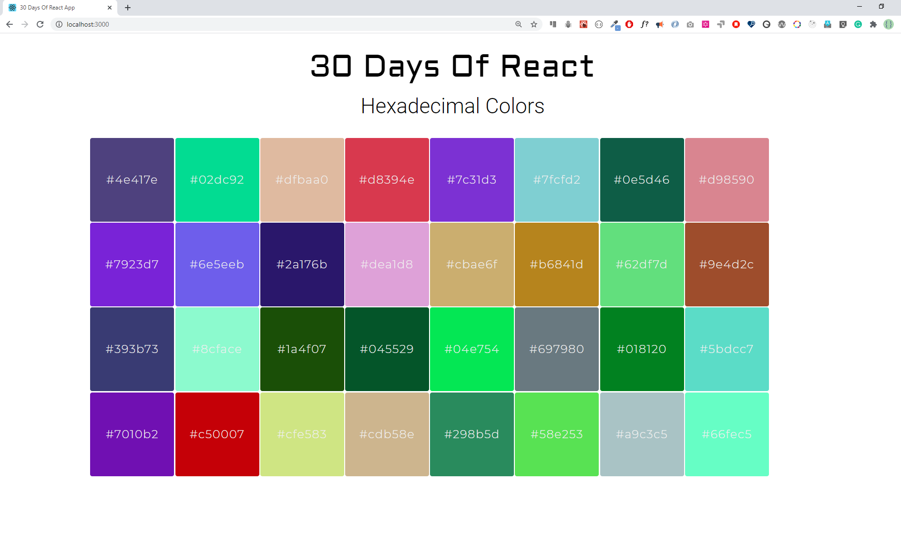

<div align="center">
  <h1> 30 Days Of React: Mapping Arrays </h1>
  <a class="header-badge" target="_blank" href="https://www.linkedin.com/in/asabeneh/">
  
  </a>
  <a class="header-badge" target="_blank" href="https://twitter.com/Asabeneh">
  
  </a>

<sub>Author:
<a href="https://www.linkedin.com/in/asabeneh/" target="_blank">Asabeneh Yetayeh</a><br>
<small> October, 2020</small>
</sub>

</div>

[<< Day 5](./../05_Day_Props/05_props.md) | [Day 7 >>](../07_Day_Class_Components/07_class_components.md)


- [Mapping arrays](#mapping-arrays)
  - [Mapping and rendering arrays](#mapping-and-rendering-arrays)
    - [Mapping array of numbers](#mapping-array-of-numbers)
    - [Mapping array of arrays](#mapping-array-of-arrays)
    - [Mapping array of objects](#mapping-array-of-objects)
    - [Key in mapping arrays](#key-in-mapping-arrays)
- [Exercises](#exercises)
  - [Exercises: Level 1](#exercises-level-1)
  - [Exercises: Level 2](#exercises-level-2)
  - [Exercises: Level 3](#exercises-level-3)

# Mapping arrays

An array is the most frequently used data structure to handle many kinds of problems. In React, we use map to modify an array to list of JSX by adding a certain HTML elements to each element of an array.

## Mapping and rendering arrays

Most of the time data is in the form of an array or an array of objects. To render this array or array of objects most of the time we modify the data using _map_. In the previous section, we have rendered the techs list using a map method. In this section, we will see more examples.

In the following examples, you will see how we render an array of numbers, an array of strings, an array of countries and an array of skills on the browser.

```js
import React from 'react'
import ReactDOM from 'react-dom'
const App = () => {
  return (
    <div className='container'>
      <div>
        <h1>Numbers List</h1>
        {[1, 2, 3, 4, 5]}
      </div>
    </div>
  )
}

const rootElement = document.getElementById('root')
ReactDOM.render(<App />, rootElement)
```

If you check the browser, you will see the numbers are attached together in one line. To avoid this, we modify the array and change the array elements to JSX element. See the example below, the array has been modified to a list of JSX elements.

### Mapping array of numbers

```js
import React from 'react'
import ReactDOM from 'react-dom'

const Numbers = ({ numbers }) => {
  // modifying array to array of li JSX
  const list = numbers.map((number) => <li>{number}</li>)
  return list
}

// App component

const App = () => {
  const numbers = [1, 2, 3, 4, 5]

  return (
    <div className='container'>
      <div>
        <h1>Numbers List</h1>
        <ul>
          <Numbers numbers={numbers} />
        </ul>
      </div>
    </div>
  )
}

const rootElement = document.getElementById('root')
ReactDOM.render(<App />, rootElement)
```

### Mapping array of arrays

Let's see how to map array of arrays

```js
import React from 'react'
import ReactDOM from 'react-dom'

const skills = [
  ['HTML', 10],
  ['CSS', 7],
  ['JavaScript', 9],
  ['React', 8],
]

// Skill Component
const Skill = ({ skill: [tech, level] }) => (
  <li>
    {tech} {level}
  </li>
)

// Skills Component
const Skills = ({ skills }) => {
  const skillsList = skills.map((skill) => <Skill skill={skill} />)
  console.log(skillsList)
  return <ul>{skillsList}</ul>
}

const App = () => {
  return (
    <div className='container'>
      <div>
        <h1>Skills Level</h1>
        <Skills skills={skills} />
      </div>
    </div>
  )
}

const rootElement = document.getElementById('root')
ReactDOM.render(<App />, rootElement)
```

### Mapping array of objects

Rendering array of objects

```js
import React from 'react'
import ReactDOM from 'react-dom'

const countries = [
  { name: 'Finland', city: 'Helsinki' },
  { name: 'Sweden', city: 'Stockholm' },
  { name: 'Denmark', city: 'Copenhagen' },
  { name: 'Norway', city: 'Oslo' },
  { name: 'Iceland', city: 'Reykjavík' },
]

// Country component
const Country = ({ country: { name, city } }) => {
  return (
    <div>
      <h1>{name}</h1>
      <small>{city}</small>
    </div>
  )
}

// countries component
const Countries = ({ countries }) => {
  const countryList = countries.map((country) => <Country country={country} />)
  return <div>{countryList}</div>
}
// App component
const App = () => (
  <div className='container'>
    <div>
      <h1>Countries List</h1>
      <Countries countries={countries} />
    </div>
  </div>
)

const rootElement = document.getElementById('root')
ReactDOM.render(<App />, rootElement)
```

### Key in mapping arrays

Keys help React to identify items which have changed, added, or removed. Keys should be given to the elements inside the array to give the elements a stable identity. The key should be unique. Mostly data will come with as an id and we can use id as key. If we do not pass key to React during mapping it raises a warning on the browser. If the data does not have an id we have to find a way to create a unique identifier for each element when we map it. See the following example:

```js
import React from 'react'
import ReactDOM from 'react-dom'

const Numbers = ({ numbers }) => {
  // modifying array to array of li JSX
  const list = numbers.map((num) => <li key={num}>{num}</li>)
  return list
}

const App = () => {
  const numbers = [1, 2, 3, 4, 5]

  return (
    <div className='container'>
      <div>
        <h1>Numbers List</h1>
        <ul>
          <Numbers numbers={numbers} />
        </ul>
      </div>
    </div>
  )
}

const rootElement = document.getElementById('root')
ReactDOM.render(<App />, rootElement)
```

Let's also add in key in countries mapping example.

```js
import React from 'react'
import ReactDOM from 'react-dom'

const countries = [
  { name: 'Finland', city: 'Helsinki' },
  { name: 'Sweden', city: 'Stockholm' },
  { name: 'Denmark', city: 'Copenhagen' },
  { name: 'Norway', city: 'Oslo' },
  { name: 'Iceland', city: 'Reykjavík' },
]

// Country component
const Country = ({ country: { name, city } }) => {
  return (
    <div>
      <h1>{name}</h1>
      <small>{city}</small>
    </div>
  )
}

// countries component
const Countries = ({ countries }) => {
  const countryList = countries.map((country) => (
    <Country key={country.name} country={country} />
  ))
  return <div>{countryList}</div>
}
const App = () => (
  <div className='container'>
    <div>
      <h1>Countries List</h1>
      <Countries countries={countries} />
    </div>
  </div>
)

const rootElement = document.getElementById('root')
ReactDOM.render(<App />, rootElement)
```

# Exercises

## Exercises: Level 1

1. Why you need to map an array ?  
   Tại sao cần sử dụng `map` trên một mảng?  
   ✅ We use `map` to iterate over an array and transform each element into a new format, often to render a list of React elements.  
   ✅ Chúng ta dùng `map` để lặp qua mảng và biến đổi mỗi phần tử thành định dạng mới, thường để render một danh sách các React element.  

2. Why we need keys during mapping an array ?  
   Tại sao cần dùng `key` khi map một mảng?  
   ✅ Keys help React identify which items have changed, been added, or removed, improving performance and avoiding unnecessary re-renders.  
   ✅ Key giúp React nhận biết phần tử nào đã thay đổi, thêm hoặc xóa, cải thiện hiệu suất và tránh render lại không cần thiết.  

3. What is the importance of destructuring your code ?  
   Tầm quan trọng của việc destructuring trong code là gì?  
   ✅ Destructuring makes it easier to extract values from objects or arrays, reducing repetitive code and making code cleaner.  
   ✅ Destructuring giúp lấy giá trị từ object hoặc array dễ dàng hơn, giảm lặp lại code và làm code gọn gàng hơn.  

4. Does destructuring make your code clean and easy to read ?  
   Destructuring có giúp code gọn gàng và dễ đọc không?  
   ✅ Yes, destructuring improves code readability by clearly showing which values are being used without repeatedly accessing object properties.  
   ✅ Có, destructuring cải thiện khả năng đọc code bằng cách hiển thị rõ ràng những giá trị nào đang được sử dụng mà không cần truy cập nhiều lần vào các property của object.  

## Exercises: Level 2

1. In the following design, evens are green, odds are yellow and prime numbers are red. Build the following colors using React component


2. Create the following hexadecimal colors using React component



## Exercises: Level 3

1.Make the following bar group using the given [data](../06_Day_Map_List_Keys/06_map_list_keys_boilerplate/src/data/ten_most_highest_populations.js)


🎉 CONGRATULATIONS ! 🎉

[<< Day 5](./../05_Day_Props/05_props.md) | [Day 7 >>](../07_Day_Class_Components/07_class_components.md)
