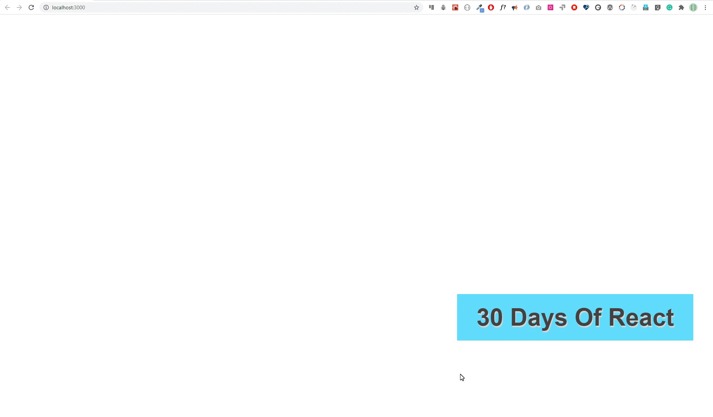

<div align="center">
  <h1> 30 Days Of React: Events</h1>
  <a class="header-badge" target="_blank" href="https://www.linkedin.com/in/asabeneh/">
  
  </a>
  <a class="header-badge" target="_blank" href="https://twitter.com/Asabeneh">
  
  </a>

<sub>Author:
<a href="https://www.linkedin.com/in/asabeneh/" target="_blank">Asabeneh Yetayeh</a><br>
<small> October, 2020</small>
</sub>

</div>

[<< Day 10](../10_React_Project_Folder_Structure/10_react_project_folder_structure.md) | [Day 12 >>](../12_Day_Forms/12_forms.md)


- [Events](#events)
  - [What is an event?](#what-is-an-event)
- [Exercises](#exercises)
  - [**Exercises: Level 1 – React Events (Class Components)**](#exercises-level-1--react-events-class-components)
  - [Exercises: Level 2](#exercises-level-2)
  - [Exercises: Level 3](#exercises-level-3)

# Events

## What is an event?

An event is an action or occurrence recognized by a software. To make an event more clear let's use the daily activities we do when we use a computer such as clicking on a button, hover on an image, pressing a keyboard, scrolling the mouse wheel and etc. In this section, we will focus only some of the mouse and keyboard events. The react documentation has already a detail note about [events](https://reactjs.org/docs/handling-events.html).

Handling events in React is very similar to handling elements on DOM elements using pure JavaScript. Some of the syntax difference between handling event in React and pure JavaScript:

- React events are named using camelCase, rather than lowercase.
- With JSX you pass a function as the event handler, rather than a string.

Let's see some examples to understand event handling.

Event handling in HTML

```html
<!DOCTYPE html>
<html lang="en">
  <head>
    <meta charset="utf-8" />
    <title>30 Days Of React App</title>
  </head>
  <body>
    <button>onclick="greetPeople()">Greet People</button>
    <script>
      const greetPeople = () => {
        alert('Welcome to 30 Days Of React Challenge')
      }
    </script>
  </body>
</html>
```

In React, it is slightly different

```js
import React from 'react'
// if it is functional components
const App = () => {
  const greetPeople = () => {
    alert('Welcome to 30 Days Of React Challenge')
  }
  return <button onClick={greetPeople}> </button>
}
```

```js
import React, { Component } from 'react'
// if it is functional components
class App extends Component {
  greetPeople = () => {
    alert('Welcome to 30 Days Of React Challenge')
  }
  render() {
    return <button onClick={this.greetPeople}> </button>
  }
}
```

Another difference between HTML and React event is that you cannot return false to prevent default behavior in React. You must call preventDefault explicitly. For example, with plain HTML, to prevent the default link behavior of opening a new page, you can write:

Plain HTML

```html
<a href="#" onclick="console.log('The link was clicked.'); return false">
  Click me
</a>
```

However, in React it could be as follows:

```js
import React, { Component } from 'react'
// if it is functional components
class App extends Component {
  handleClick = () => {
    alert('Welcome to 30 Days Of React Challenge')
  }
  render() {
    return (
      <a href='#' onClick={this.handleClick}>
        Click me
      </a>
    )
  }
}
```

Event handling is a very vast topic and in this challenge we will focus on the most common event types. We may use the following mouse and keyboard events.
_onMouseMove, onMouseEnter, onMouseLeave, onMouseOut, onClick, onKeyDown, onKeyPress, onKeyUp, onCopy, onCut, onDrag, onChange,onBlur,onInput, onSubmit_

Let's implement some more mouse and keyboard events.

```js
// index.js
import React, { Component } from 'react'
import ReactDOM from 'react-dom'

class App extends Component {
  state = {
    firstName: '',
    message: '',
    key: '',
  }
  handleClick = (e) => {
    // e gives an event object
    // check the value of e using console.log(e)
    this.setState({
      message: 'Welcome to the world of events',
    })
  }
  // triggered whenever the mouse moves
  handleMouseMove = (e) => {
    this.setState({ message: 'mouse is moving' })
  }
  // to get value when an input field changes a value
  handleChange = (e) => {
    this.setState({
      firstName: e.target.value,
      message: e.target.value,
    })
  }

  // to get keyboard key code when an input field is pressed
  // it works with input and textarea
  handleKeyPress = (e) => {
    this.setState({
      message:
        `${e.target.value} has been pressed and the keycode is` + e.charCode,
    })
  }
  // Blurring happens when a mouse leave an input field
  handleBlur = (e) => {
    this.setState({ message: 'Input field has been blurred' })
  }
  // This event triggers during a text copy
  handleCopy = (e) => {
    this.setState({
      message: 'Using 30 Days Of React for commercial purpose is not allowed',
    })
  }
  render() {
    return (
      <div>
        <h1>Welcome to the World of Events</h1>

        <button onClick={this.handleClick}>Click Me</button>
        <button onMouseMove={this.handleMouseMove}>Move mouse on me</button>
        <p onCopy={this.handleCopy}>
          Check copy right permission by copying this text
        </p>

        <p>{this.state.message}</p>
        <label htmlFor=''> Test for onKeyPress Event: </label>
        <input type='text' onKeyPress={this.handleKeyPress} />
        <br />

        <label htmlFor=''> Test for onBlur Event: </label>
        <input type='text' onBlur={this.handleBlur} />

        <form onSubmit={this.handleSubmit}>
          <div>
            <label htmlFor='firstName'>First Name: </label>
            <input
              onChange={this.handleChange}
              name='firstName'
              value={this.state.value}
            />
          </div>

          <div>
            <input type='submit' value='Submit' />
          </div>
        </form>
      </div>
    )
  }
}

const rootElement = document.getElementById('root')
// we render the JSX element using the ReactDOM package
ReactDOM.render(<App />, rootElement)
```

# Exercises

---

## **Exercises: Level 1 – React Events (Class Components)**

**1. What is an event?**

* An **event** is an action triggered by the user or browser, such as clicking a button, typing in an input, hovering over an element, or submitting a form.
* React uses events to let components **respond to user interactions**.

---

**2. What is the difference between an HTML element event and React event?**

| Aspect                 | HTML Event                                 | React Event                                                                |
| ---------------------- | ------------------------------------------ | -------------------------------------------------------------------------- |
| Naming                 | lowercase: `onclick`                       | camelCase: `onClick`                                                       |
| Handling               | string: `<button onclick="doSomething()">` | function reference: `<button onClick={this.handleClick}>`                  |
| Synthetic Event        | ❌                                          | ✅ React wraps events in **SyntheticEvent** for cross-browser compatibility |
| Memory Leak Prevention | ❌                                          | ✅ React automatically handles event cleanup in components                  |

---

**3. Write at least 4 keyboard events**

* `onKeyDown` – triggered when a key is pressed
* `onKeyUp` – triggered when a key is released
* `onKeyPress` – triggered while a key is being pressed
* `onInput` – triggered when input changes via keyboard

---

**4. Write at least 8 mouse events**

* `onClick` – click on element
* `onDoubleClick` – double click
* `onMouseEnter` – mouse enters element
* `onMouseLeave` – mouse leaves element
* `onMouseOver` – mouse moves over element
* `onMouseOut` – mouse moves out of element
* `onMouseDown` – mouse button pressed
* `onMouseUp` – mouse button released

---

**5. What are the most common mouse and keyboard events?**

* **Mouse:** `onClick`, `onDoubleClick`, `onMouseEnter`, `onMouseLeave`
* **Keyboard:** `onKeyDown`, `onKeyUp`, `onKeyPress`

---

**6. Write an event specific to input element**

* `onChange` – triggered when the value of input changes
* `onFocus` – triggered when input is focused
* `onBlur` – triggered when input loses focus

---

**7. Write an event specific to form element**

* `onSubmit` – triggered when a form is submitted

---

**8. Display the coordinate of the viewport when a mouse is moving on the body**

```jsx
import React, { Component } from "react";

export default class MouseCoordinates extends Component {
  constructor(props) {
    super(props);
    this.state = { x: 0, y: 0 };
  }

  handleMouseMove = (event) => {
    this.setState({ x: event.clientX, y: event.clientY });
  };

  render() {
    return (
      <div
        style={{ height: "100vh" }}
        onMouseMove={this.handleMouseMove}
      >
        Mouse Coordinates: X: {this.state.x}, Y: {this.state.y}
      </div>
    );
  }
}
```

---

**9. What is the difference between `onInput`, `onChange` and `onBlur`?**

| Event      | Triggered When                                                                                       |
| ---------- | ---------------------------------------------------------------------------------------------------- |
| `onInput`  | Value of input changes **immediately** (as user types)                                               |
| `onChange` | Value of input changes and element loses focus, or React triggers change (for controlled components) |
| `onBlur`   | Input **loses focus**                                                                                |

---

**10. Where do we put the `onSubmit` event?**

* `onSubmit` is added **directly to the `<form>` element**, not to individual inputs or buttons.

```jsx
<form onSubmit={this.handleSubmit}>
  <input type="text" />
  <button type="submit">Submit</button>
</form>
```

---

✅ **Logic Note:**

* Trong React class component, **event handlers cần bind** hoặc khai báo bằng arrow function (`handleEvent = () => {}`).
* Tất cả events trong React đều là **synthetic events**, nên bạn **không dùng string handlers** như HTML.


## Exercises: Level 2

Implement the following using onMouseEnter event


**Mouse Avoiding Button (Class Component)**

**Task:** Layout with **1 button centered**, when mouse moves over it, the button moves away using `onMouseEnter`.

**Class Component Implementation (logic only, no fancy UI):**

```jsx
import React, { Component } from "react";

export default class AvoidButton extends Component {
  constructor(props) {
    super(props);
    this.state = {
      top: "50%",  // initial vertical position
      left: "50%", // initial horizontal position
    };
  }

  handleMouseEnter = () => {
    // Randomly move button to a new position within viewport
    const viewportWidth = window.innerWidth - 100;  // button width approx 100px
    const viewportHeight = window.innerHeight - 50; // button height approx 50px

    const newLeft = Math.random() * viewportWidth;
    const newTop = Math.random() * viewportHeight;

    this.setState({ top: `${newTop}px`, left: `${newLeft}px` });
  };

  render() {
    const { top, left } = this.state;

    const style = {
      position: "absolute",
      top: top,
      left: left,
      transform: "translate(-50%, -50%)",
      padding: "10px 20px",
      cursor: "pointer",
    };

    return (
      <div style={{ width: "100vw", height: "100vh", position: "relative" }}>
        <button style={style} onMouseEnter={this.handleMouseEnter}>
          Catch me!
        </button>
      </div>
    );
  }
}
```

---

✅ **Logic explanation:**

1. `state` lưu vị trí button (`top` và `left`).
2. `handleMouseEnter` được gọi **khi chuột vào button**, tạo **tọa độ ngẫu nhiên** trong viewport và cập nhật state.
3. Button **position: absolute** để di chuyển linh hoạt trên toàn màn hình.
4. `transform: translate(-50%, -50%)` để **center button tại tọa độ top-left**.

💡 Bạn có thể mở rộng logic để button **né gần biên hoặc chỉ di chuyển trong 1 khu vực nhất định**.
## Exercises: Level 3

Coming

🎉 CONGRATULATIONS ! 🎉

[<< Day 10](../10_React_Project_Folder_Structure/10_react_project_folder_structure.md) | [Day 12 >>](../12_Day_Forms/12_forms.md)
