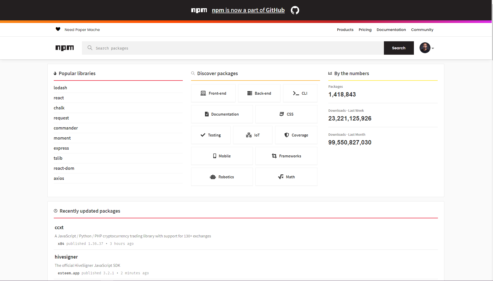

<div align="center">
  <h1> 30 Days Of React:Third Party Packages</h1>
  <a class="header-badge" target="_blank" href="https://www.linkedin.com/in/asabeneh/">
  
  </a>
  <a class="header-badge" target="_blank" href="https://twitter.com/Asabeneh">
  
  </a>

<sub>Author:
<a href="https://www.linkedin.com/in/asabeneh/" target="_blank">Asabeneh Yetayeh</a><br>
<small> October, 2020</small>
</sub>

</div>

[<< Day 14](../14_Day_Component_Life_Cycles/14_component_life_cycles.md) | [Day 16 >>](../16_Higher_Order_Component/16_higher_order_component.md)


- [Third Party Packages](#third-party-packages)
  - [NPM or Yarn](#npm-or-yarn)
    - [node-sass](#node-sass)
    - [CSS modules](#css-modules)
    - [axios](#axios)
    - [react-icons](#react-icons)
    - [moment](#moment)
    - [styled-components](#styled-components)
    - [reactstrap](#reactstrap)
    - [lodash](#lodash)
- [Exercises](#exercises)
  - [**Exercises: Level 1 – Packages in JavaScript / Bài tập Level 1 – Package trong JavaScript**](#exercises-level-1--packages-in-javascript--bài-tập-level-1--package-trong-javascript)
  - [Exercises: Level 2](#exercises-level-2)
  - [Exercises: Level 3](#exercises-level-3)

# Third Party Packages

There are more than 1.4M JavaScript packages on npm registry. By now there is a package almost for every kind of problem. We do not have to create the wheel instead we have to know how to use the wheel. In this section, we will learn how to use npm packages and also we will implement most common package for React applications. As of October 10, 2020, the npm registry popular packages, total number of packages, downloads per week and downloads per month seems as shown below.



In one way or the other you many need the following packages in your React applications. Specially node-sass, moment and axios are important for some projects.

- [node-sass](https://www.npmjs.com/package/node-sass)
- [moment](https://www.npmjs.com/package/moment)
- [axios](https://www.npmjs.com/package/axios)
- [react-icons](https://react-icons.github.io/react-icons/)
- [styled-components](https://styled-components.com/)
- [reactstrap](https://reactstrap.github.io/)
- [lodash](https://www.npmjs.com/package/lodash)
- [uuid](https://www.npmjs.com/package/uuid)

## NPM or Yarn

You can use either npm or yarn to install packages. If you want to use [yarn](https://yarnpkg.com) you have install it separately. I would recommend you to stick in one of the package. Don't use both package management tools in one application at the same time.

Let's see how to install packages to an application. First, we go to the project directory and write the following command.

```sh
// syntax, we can use i or install
npm i package-name
// or
yarn add package-name
```

### node-sass

Sass is a CSS preprocess which allows to write CSS function, nesting and many more. Let's install node-sass to make use of the power of Sass.

Using npm:

```sh
Asabeneh@DESKTOP-KGC1AKC MINGW64 ~/Desktop/30-days-of-react$ npm install node-sass
```

Using yarn:

```sh
Asabeneh@DESKTOP-KGC1AKC MINGW64 ~/Desktop/30-days-of-react$ yarn add node-sass
```

After installing node-sass you can start using Sass in React. Create a styles folder and inside this folder create test.scss. Import this file to the component you are working or index.js. You don't need import the node-sass to the component.

```css
/* ./styles/header.scss */
header {
  background-color: #61dbfb;
  padding: 25;
  padding: 10px;
  margin: 0;
}
```

```js
// Header.js
import React from 'react'
import './styles/header.scss
const Header = () = (
   <header>
          <div className='header-wrapper'>
            <h1>30 Days Of React</h1>
            <h2>Getting Started React</h2>
            <h3>JavaScript Library</h3>
            <p>Instructor: Asabeneh Yetayeh</p>
            <small>Oct 15, 2020</small>
          </div>
        </header>
)

export default Header
```

```js
// App.js

import React, { Component } from 'react'
import ReactDOM from 'react-dom'
import './styles/header.scss

class App extends Component {
  render() {
    return (
      <div className='App'>
       <Header />
      </div>
    )
  }
}

const rootElement = document.getElementById('root')
ReactDOM.render(<App />, rootElement)
```

### CSS modules

In addition to Sass, it is good to know how to use CSS modules in React. We do not have to install a separate package for a CSS module to use CSS module in React applications. CSS module can be used with Pure CSS or with Sass. The naming convention for CSS module is a specific name followed by dot and module(test.module.css or test.module.scss)

Naming:

```js
// naming for Sass
// naming for CSS
;[name].module.scss[name].module.css
```

```css
/* ./styles/header.module.scss */
.header {
  background-color: #61dbfb;
  padding: 25;
  padding: 10px;
  margin: 0;
}
.header-wrapper {
  font-weight:500
  border: 5px solid orange;
}
```

```js
// Header.js
import React from 'react'
import headerStyles from  './styles/header.module.scss
// We can all destructure the class name
const {header, headerWrapper} = headerStyles
const Header = () = (
   <header className = {headerStyles.header}>
          <div className={headerStyles.headerWrapper}>
            <h1>30 Days Of React</h1>
            <h2>Getting Started React</h2>
            <h3>JavaScript Library</h3>
            <p>Instructor: Asabeneh Yetayeh</p>
            <small>Oct 15, 2020</small>
          </div>
        </header>
)

export default Header
```

```js
// App.js

import React, { Component } from 'react'
import ReactDOM from 'react-dom'
import './styles/header.scss

class App extends Component {
  render() {
    return (
      <div className='App'>
       <Header />
      </div>
    )
  }
}

const rootElement = document.getElementById('root')
ReactDOM.render(<App />, rootElement)
```

### axios

Axios is a JavaScript library which can make HTTP requests to fetch data. In this section we will see on a get request. However, it is possible to do all the request types using [axios](https://github.com/axios/axios) (GET, POST, PUT, PATCH, DELETE).

Using npm:

```sh
Asabeneh@DESKTOP-KGC1AKC MINGW64 ~/Desktop/30-days-of-react$ npm install axios
```

Using yarn:

```sh
Asabeneh@DESKTOP-KGC1AKC MINGW64 ~/Desktop/30-days-of-react$ yarn add axios
```

```js
import React, { Component } from 'react'
// axios is a package which
// send requests to a server to fetch data
import axios from 'axios'
import ReactDOM from 'react-dom'

class App extends Component {
  state = {
    data: [],
  }
  componentDidMount() {
    const API_URL = 'https://restcountries.eu/rest/v2/all'
    axios
      .get(API_URL)
      .then((response) => {
        this.setState({
          data: response.data,
        })
      })
      .catch((error) => {
        console.log(error)
      })
  }

  renderCountries = () => {
    return this.state.data.map((country) => {
      const languageOrLanguages =
        country.languages.length > 1 ? 'Langauges' : 'Language'
      const formatLanguages = country.languages
        .map(({ name }) => name)
        .join(', ')
      return (
        <div>
          <div>
            {' '}
            {' '}
          </div>
          <div>
            <h1>{country.name}</h1>
            <p>Capital: {country.capital}</p>
            <p>
              {languageOrLanguages}: {formatLanguages}
            </p>
            <p>Population: {country.population}</p>
          </div>
        </div>
      )
    })
  }
  render() {
    return (
      <div className='App'>
        <h1>Fetching Data Using Axios</h1>
        <div>
          <p>There are {this.state.data.length} countries in the api</p>
          <div className='countries-wrapper'>{this.renderCountries()}</div>
        </div>
      </div>
    )
  }
}

const rootElement = document.getElementById('root')
ReactDOM.render(<App />, rootElement)
```

We can use axios with await and async functions. In order to implement await and async we need to have separate function outside the componentDidMount. If we implement await and async the error has to be handled by try and catch.

### react-icons

Icons are integral part of a website. To get different SVG icons

Using npm:

```sh
Asabeneh@DESKTOP-KGC1AKC MINGW64 ~/Desktop/30-days-of-react$ npm install react-icons
```

Using yarn:

```sh
Asabeneh@DESKTOP-KGC1AKC MINGW64 ~/Desktop/30-days-of-react$ yarn add react-icons
```

```js
import React, { Component } from 'react'
import axios from 'axios'
import ReactDOM from 'react-dom'
import moment from 'moment'
import {
  TiSocialLinkedinCircular,
  TiSocialGithubCircular,
  TiSocialTwitterCircular,
} from 'react-icons/ti'

const Footer = () => (
  <footer>
    <h3>30 Days Of React</h3>
    <div>
      <TiSocialLinkedinCircular />
      <TiSocialGithubCircular />
      <TiSocialTwitterCircular />
    </div>
    <div>
      <small> Copyright &copy; {new Date().getFullYear()} </small>
    </div>
  </footer>
)

class App extends Component {
  render() {
    return (
      <div className='App'>
        <h1>Welcome to the world of Icons</h1>
        <Footer />
      </div>
    )
  }
}

const rootElement = document.getElementById('root')
ReactDOM.render(<App />, rootElement)
```

### moment

Moment is a small JavaScript library which gives us different time formats.

```sh
npm install moment
```

```js
import React, { Component } from 'react'
import ReactDOM from 'react-dom'

class App extends Component {
  render() {
    return (
      <div className='App'>
        <h1>How to use moment</h1>
        <p>This challenge was started {moment('2020-10-01').fromNow()}</p>
        <p>The challenge will be over in {moment('2020-10-30').fromNow()}</p>
        <p>Today is {moment(new Date()).format('MMMM DD, YYYY HH:mm')}</p>
      </div>
    )
  }
}

const rootElement = document.getElementById('root')
ReactDOM.render(<App />, rootElement)
```

### styled-components

It uses a tagged template literals to style a component. It removes the mapping between components and styles. This means that when you're defining your styles, you're actually creating a normal React component, that has your styles attached to it.

```js
import React, { Component } from 'react'
import ReactDOM from 'react-dom'
import styled from 'styled-components'

const Title = styled.h1`
  font-size: 70px;
  font-weight: 300;
`
const Header = styled.header`
  background-color: #61dbfb;
  padding: 25;
  padding: 10px;
  margin: 0;
`

class App extends Component {
  render() {
    return (
      <div className='App'>
        <Header>
          <div>
            <Title>30 Days Of React</Title>
            <h2>Getting Started React</h2>
            <h3>JavaScript Library</h3>
            <p>Instructor: Asabeneh Yetayeh</p>
            <small>Oct 15, 2020</small>
          </div>
        </Header>
      </div>
    )
  }
}

const rootElement = document.getElementById('root')
ReactDOM.render(<App />, rootElement)
```

### reactstrap

The [reactstrap](https://reactstrap.github.io/) package allows to use a component with bootstrap.

### lodash

According to the official lodash documentation, 'A modern JavaScript utility library delivering modularity, performance & extras.'

Try to also learn how to use the package _classnames_ and _validator_.

# Exercises

---

## **Exercises: Level 1 – Packages in JavaScript / Bài tập Level 1 – Package trong JavaScript**

---

**1. What is a package? / Package là gì?**

* **EN:** A package is a bundle of reusable code, functions, or libraries that can be shared and installed in a project.
* **VI:** Package là một gói mã có thể tái sử dụng, chứa các hàm hoặc thư viện, có thể chia sẻ và cài đặt trong dự án.

---

**2. What is a third party package? / Package của bên thứ 3 là gì?**

* **EN:** A third-party package is created by developers outside of your project or team, not built into JavaScript or React by default.
* **VI:** Package của bên thứ 3 là package được phát triển bởi các lập trình viên ngoài dự án của bạn, không có sẵn trong JavaScript hay React mặc định.

---

**3. Do you have to use third party packages? / Bạn có bắt buộc phải dùng package của bên thứ 3 không?**

* **EN:** No, using third-party packages is optional. You can write your own code, but packages save time and simplify development.
* **VI:** Không, việc dùng package bên thứ 3 là tùy chọn. Bạn có thể viết code riêng, nhưng package giúp tiết kiệm thời gian và đơn giản hóa phát triển.

---

**4. How do you know the popularity and stability of a third party package? / Làm sao biết độ phổ biến và ổn định của một package?**

* **EN:** Check npm registry stats, GitHub stars, issues, last update date, and community usage.
* **VI:** Kiểm tra số lượt download trên npm, số sao trên GitHub, issues, ngày cập nhật gần nhất và cộng đồng sử dụng.

---

**5. How many JavaScript packages are there on the npm registry? / Có bao nhiêu package JavaScript trên npm?**

* **EN:** Over **1.5 million** packages (as of 2025).
* **VI:** Hơn **1,5 triệu** package (tính đến 2025).

---

**6. How do you install a third party package? / Làm sao cài đặt package bên thứ 3?**

* **EN:** Use npm or yarn:

```bash
npm install package-name
# or
yarn add package-name
```

* **VI:** Dùng npm hoặc yarn:

```bash
npm install package-name
# hoặc
yarn add package-name
```

---

**7. What packages do you use most frequently? / Những package bạn thường dùng nhất là gì?**

* **EN:** Examples: `react-router-dom`, `axios`, `classnames`, `validator`, `redux`, `moment`, `lodash`.
* **VI:** Ví dụ: `react-router-dom`, `axios`, `classnames`, `validator`, `redux`, `moment`, `lodash`.

---

**8. What package do you use to fetch data? / Package nào dùng để fetch data?**

* **EN:** `axios` or built-in `fetch` API.
* **VI:** `axios` hoặc API `fetch` có sẵn trong trình duyệt.

---

**9. What is the purpose of classnames package? / Mục đích của package classnames là gì?**

* **EN:** To conditionally combine multiple CSS class names into a single string.
* **VI:** Dùng để kết hợp nhiều class CSS một cách điều kiện thành một chuỗi duy nhất.

```jsx
import classNames from 'classnames';

const btnClass = classNames('btn', { 'btn-primary': isPrimary });
```

---

**10. What is the purpose of validator package? / Mục đích của package validator là gì?**

* **EN:** To validate and sanitize strings like emails, URLs, phone numbers, passwords, etc.
* **VI:** Dùng để kiểm tra và làm sạch các chuỗi như email, URL, số điện thoại, mật khẩu, v.v.


## Exercises: Level 2

1. Learn how to use Sass / Học cách dùng Sass

* **EN:** Sass is a CSS preprocessor that allows variables, nesting, and mixins.
* **VI:** Sass là CSS preprocessor giúp dùng biến, nested CSS và mixin.

```scss
// styles.scss
$primary-color: #00bfff;

.button {
  background-color: $primary-color;
  &:hover {
    background-color: darken($primary-color, 10%);
  }
}
```

```jsx
import React, { Component } from "react";
import "./styles.scss";

export default class App extends Component {
  render() {
    return <button className="button">Click Me</button>;
  }
}
```

* Install Sass: `npm install sass`

---

2. Learn how to use axios / Học cách dùng axios

* **EN:** Axios is a library to make HTTP requests.
* **VI:** Axios là thư viện để gửi yêu cầu HTTP (GET, POST, v.v.).

```jsx
import React, { Component } from "react";
import axios from "axios";

export default class FetchData extends Component {
  state = { data: null };

  componentDidMount() {
    axios.get("https://jsonplaceholder.typicode.com/todos/1")
      .then(response => this.setState({ data: response.data }))
      .catch(error => console.error(error));
  }

  render() {
    return <div>{this.state.data ? JSON.stringify(this.state.data) : "Loading..."}</div>;
  }
}
```

---

3. Learn how to use moment and react-icons / Học cách dùng moment và react-icons

* **EN:** Moment handles date and time; React-icons provides ready-to-use icons.
* **VI:** Moment xử lý ngày giờ; React-icons cung cấp icon sẵn dùng.

```jsx
import React, { Component } from "react";
import moment from "moment";
import { FaBeer } from "react-icons/fa";

export default class IconExample extends Component {
  render() {
    const now = moment().format("YYYY-MM-DD HH:mm:ss");
    return <div>{now} Cheers! <FaBeer /></div>;
  }
}
```

* Install: `npm install moment react-icons`

---

4. Use the validator package to validate the form you had in day 12 / Dùng validator để validate form của ngày 12

```jsx
import React, { Component } from "react";
import validator from "validator";

export default class ValidatorForm extends Component {
  state = { email: "", errors: {} };

  handleChange = (e) => this.setState({ email: e.target.value });

  handleSubmit = (e) => {
    e.preventDefault();
    const errors = {};
    if (!validator.isEmail(this.state.email)) {
      errors.email = "Invalid email";
    }
    this.setState({ errors });
    if (Object.keys(errors).length === 0) console.log("Form submitted");
  };

  render() {
    return (
      <form onSubmit={this.handleSubmit}>
        <input type="email" value={this.state.email} onChange={this.handleChange} />
        {this.state.errors.email && <p>{this.state.errors.email}</p>}
        <button type="submit">Submit</button>
      </form>
    );
  }
}
```

---

5. Use classnames to change a class based on some logic / Dùng classnames thay đổi class theo logic

```jsx
import React, { Component } from "react";
import classNames from "classnames";

export default class ClassNamesExample extends Component {
  state = { isActive: false };

  toggleActive = () => this.setState({ isActive: !this.state.isActive });

  render() {
    const btnClass = classNames("button", { "active": this.state.isActive });
    return <button className={btnClass} onClick={this.toggleActive}>Click Me</button>;
  }
}
```

* **EN:** The `active` class is added only if `isActive` is true.
* **VI:** Class `active` chỉ được thêm khi `isActive` là true.


## Exercises: Level 3

🎉 CONGRATULATIONS ! 🎉

[<< Day 14](../14_Day_Component_Life_Cycles/14_component_life_cycles.md) | [Day 16 >>]()
