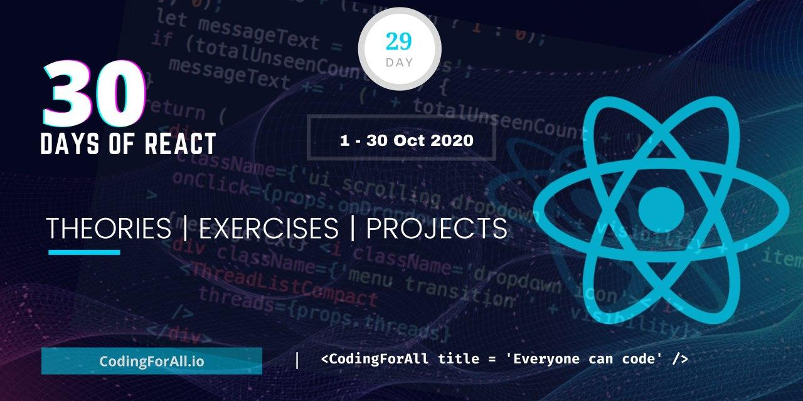

<div align="center">
  <h1> 30 Days Of React: Project</h1>
  <a class="header-badge" target="_blank" href="https://www.linkedin.com/in/asabeneh/">
  
  </a>
  <a class="header-badge" target="_blank" href="https://twitter.com/Asabeneh">
  
  </a>

<sub>Author:
<a href="https://www.linkedin.com/in/asabeneh/" target="_blank">Asabeneh Yetayeh</a><br>
<small> October, 2020</small>
</sub>

</div>

[<< Day 28](../27_Ref/27_ref.md) | [Day 29 >>](../29_explore/29_explore.md)



# Explore

Congratulations for making to this far. You are are unstoppable. So far you have learned lots of concepts and also built several mini-projects. I believe those mini-projects have helped you to understand React very well. After this, you can work on a sole or group React project. You can also expand your skill by using different packages (classnames, lodash, react-helmet, recharts, etc.), implementing PWA, styled components and CSS libraries with React application. In addition, learn SEO, accessibility, responsiveness and browser compatibility. Explore more and increase your knowledge in the domain. Read the [React documentation](https://reactjs.org/). Now, you should feel confident enough about your React skill and you should also start applying for entry or junior softer developer or front end developer positions. No one will tell you that you are read for a job, so you should make yourself ready.

# Exercises

## Exercises: Level 1

1. Polish your GitHub and make your projects as clean as possible
2. Work on your portfolio
3. Create LinkedIn account if you don't have yet. If you have LinkedIn account make it as attractive as possible. It will give a high chance for potential recruiters and companies to know more about you. In addition, there are lots of materials and people who can be used as motivation on daily basis.
4. Follow the author on LinkedIn, Twitter or GitHuh if he created impact on your life.
5. Become an ambassador of CodingForAll by supporting and advocating our causes.
6. Write about 30DaysOfReact on different platforms and create an opportunity for others to get a valuable skill.

## Exercises: Level 2

### 1️⃣ Build a Personal Portfolio Website

**Task / Yêu cầu:**

* Sử dụng **React** để xây dựng portfolio cá nhân.
* Bao gồm các phần: Home, About, Projects, Contact.
* Dùng **React Router** để điều hướng.
* Dùng **components reusable** cho card dự án, nút, header, footer.
* Thêm **responsive design** (grid/flex).
* Tối ưu SEO cơ bản: title, meta description (react-helmet).
* Optional: Thêm **Dark/Light mode** dùng `useContext`.

**Gợi ý giải pháp:**

```javascript
// App.js
import { BrowserRouter as Router, Routes, Route } from 'react-router-dom';
import Home from './pages/Home';
import About from './pages/About';
import Projects from './pages/Projects';
import Contact from './pages/Contact';

function App() {
  return (
    <Router>
      <Routes>
        <Route path="/" element={<Home />} />
        <Route path="/about" element={<About />} />
        <Route path="/projects" element={<Projects />} />
        <Route path="/contact" element={<Contact />} />
      </Routes>
    </Router>
  );
}

export default App;
```

* Tạo **ProjectCard.js** để hiển thị các dự án.
* Dùng **map()** để render dự án từ JSON hoặc API.
* CSS: grid/flex, media queries để responsive.
* Thêm **form liên hệ** dùng controlled input và validation.

---

### 2️⃣ Convert Existing Projects to Use Custom Hooks

**Task / Yêu cầu:**

* Ví dụ: Todo List hoặc Twitter Clone.
* Tách toàn bộ logic CRUD hoặc fetch API ra **custom hook** (`useTodos`, `useTweets`, `useFetch`).
* UI chỉ tập trung render và event handlers.
* Lợi ích: code gọn, reusable, dễ maintain.

**Gợi ý giải pháp:**

```javascript
// useTodos.js
import { useState, useEffect } from 'react';

const useTodos = () => {
  const [todos, setTodos] = useState([]);

  useEffect(() => {
    const saved = JSON.parse(localStorage.getItem('todos')) || [];
    setTodos(saved);
  }, []);

  useEffect(() => {
    localStorage.setItem('todos', JSON.stringify(todos));
  }, [todos]);

  const addTodo = (text) => setTodos([...todos, text]);
  const deleteTodo = (index) => setTodos(todos.filter((_, i) => i !== index));
  const updateTodo = (index, text) => {
    const newTodos = [...todos];
    newTodos[index] = text;
    setTodos(newTodos);
  };

  return { todos, addTodo, deleteTodo, updateTodo };
};

export default useTodos;
```

---

### 3️⃣ Fetch Data from an API and Display Charts

**Task / Yêu cầu:**

* Chọn **API** (ví dụ countries API, cat API, COVID API…).
* Fetch data với `useEffect` hoặc custom hook `useFetch`.
* Visualize data bằng **recharts** (bar, pie, line chart).
* Optional: Filter hoặc search data.

**Gợi ý giải pháp:**

```javascript
import React from 'react';
import useFetch from './useFetch';
import { BarChart, Bar, XAxis, YAxis, Tooltip } from 'recharts';

const CountriesChart = () => {
  const data = useFetch('https://restcountries.eu/rest/v2/all');

  const chartData = data.map(c => ({ name: c.name, population: c.population }));

  return (
    <BarChart width={600} height={400} data={chartData}>
      <XAxis dataKey="name" />
      <YAxis />
      <Tooltip />
      <Bar dataKey="population" fill="#8884d8" />
    </BarChart>
  );
};

export default CountriesChart;
```

---

### 4️⃣ Implement Dark/Light Mode Globally

**Task / Yêu cầu:**

* Sử dụng `useContext` và `useReducer` để quản lý theme.
* Cung cấp nút toggle ở header/footer.
* Thay đổi style toàn app dựa trên theme.

**Gợi ý giải pháp:**

```javascript
import { createContext, useState, useContext } from 'react';

const ThemeContext = createContext();

export const ThemeProvider = ({ children }) => {
  const [darkMode, setDarkMode] = useState(false);
  const toggleTheme = () => setDarkMode(prev => !prev);
  return (
    <ThemeContext.Provider value={{ darkMode, toggleTheme }}>
      {children}
    </ThemeContext.Provider>
  );
};

export const useTheme = () => useContext(ThemeContext);
```

Trong App:

```javascript
import { ThemeProvider, useTheme } from './ThemeContext';

function App() {
  const { darkMode, toggleTheme } = useTheme();
  return (
    <div className={darkMode ? 'dark' : 'light'}>
      <button onClick={toggleTheme}>Toggle Theme</button>
    </div>
  );
}
```

---

### 5️⃣ Optional: Deploy Your Projects

* Deploy portfolio + mini projects lên **Netlify, Vercel hoặc GitHub Pages**.
* Share link GitHub & live site trong portfolio.

---

### ✅ Level 2 Goals:

1. Thực hành nâng cao với **custom hook**, **context**, **charts**, **controlled/uncontrolled inputs**.
2. Làm portfolio **chuyên nghiệp, responsive và SEO-friendly**.
3. Triển khai dự án thực tế, sẵn sàng show recruiter.

Coming ...

🎉 CONGRATULATIONS ! 🎉

[<< Day 27](../27_Ref/27_ref.md) | [Day 29>>]()
