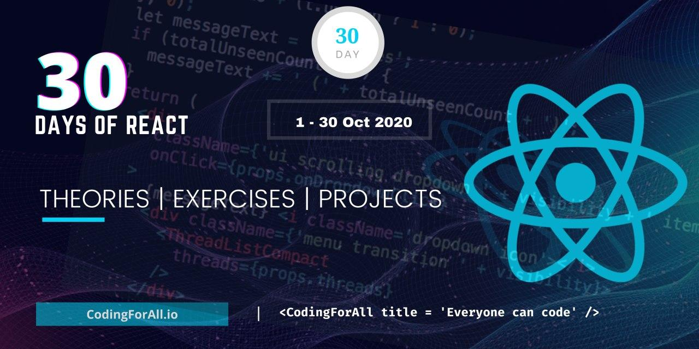

<div align="center">
  <h1> 30 Days Of React: Conclusions</h1>
  <a class="header-badge" target="_blank" href="https://www.linkedin.com/in/asabeneh/">
  
  </a>
  <a class="header-badge" target="_blank" href="https://twitter.com/Asabeneh">
  
  </a>

<sub>Author:
<a href="https://www.linkedin.com/in/asabeneh/" target="_blank">Asabeneh Yetayeh</a><br>
<small> October, 2020</small>
</sub>

</div>

[<< Day 29](../29_explore/29_explore.md)



# Conclusions

In this challenge, we have covered React with and without hooks. All the most important features of React has been included. If you did all the exercises and projects in this challenge I would say your React and JavaScript level is very high. You are ready for developer positions. This challenge was made in this month and it will be updated and improved in the coming months. We will correct grammar and typo mistakes. Some content might be added, the pending exercises in some days challenge will be included. It is good to check it at some point, because there might be some interesting projects.
You have been learning and coding for the last 30 days and you made it to this day. You are a special person and you deserve recognition. Therefore, you can claim a 30 Days React challenge completion certificate. In addition, celebrate your success with a friend and family. I will see you in another challenge or courses. Thank you for being a proactive community member and part of the challenge. Finally, recommend the material for a family, friend or enemy if you believe that it helped you and of course support the author to create more learning materials.

## Testimony
Now it is time to express your thoughts about the Author and 30DaysOfReact. You can leave your testimonial on this [link](https://www.asabeneh.com/testimonials)


# Exercises - Final Challenge


## Bài tập tổng hợp 

### 1️⃣ Build a Complete Portfolio with CRUD & API

**Task / Yêu cầu:**

* Create a **personal React portfolio**.
* Tạo **portfolio cá nhân** bằng React.
* Sections / Phần:

  * Home / About / Projects / Contact
  * **Projects** hiển thị danh sách dự án:

    * Data lưu trong state hoặc fetch từ local JSON/API.
    * Cho phép **CRUD**: Add / Update / Delete projects.
  * Tách logic CRUD vào **custom hook** `useProjects`.
  * Sử dụng **controlled input** cho form.
  * UI **responsive**, dùng **grid/flex**.
  * Optional: Dark/Light mode với **context**.

**Gợi ý / Hint: Custom hook – useProjects**

```javascript
// useProjects.js
import { useState, useEffect } from 'react';

const useProjects = () => {
  const [projects, setProjects] = useState([]);

  useEffect(() => {
    const saved = JSON.parse(localStorage.getItem('projects')) || [];
    setProjects(saved);
  }, []);

  useEffect(() => {
    localStorage.setItem('projects', JSON.stringify(projects));
  }, [projects]);

  const addProject = (project) => setProjects([...projects, project]);
  const deleteProject = (index) => setProjects(projects.filter((_, i) => i !== index));
  const updateProject = (index, project) => {
    const newProjects = [...projects];
    newProjects[index] = project;
    setProjects(newProjects);
  };

  return { projects, addProject, deleteProject, updateProject };
};

export default useProjects;
```

---

### 2️⃣ Fetch External Data and Visualize / Lấy dữ liệu từ API và trực quan hóa

**Task / Yêu cầu:**

* Chọn **API**: countries, cats, COVID-19…
* Tạo **custom hook** `useFetch`.
* Hiển thị dữ liệu trong **table hoặc card**.
* Sử dụng **recharts** để tạo biểu đồ (Bar, Pie, Line…)
* Optional: Filter hoặc search dữ liệu

```javascript
// useFetch.js
import { useState, useEffect } from 'react';

const useFetch = (url) => {
  const [data, setData] = useState([]);
  const [loading, setLoading] = useState(true);
  const [error, setError] = useState(null);

  useEffect(() => {
    const fetchData = async () => {
      try {
        const res = await fetch(url);
        const json = await res.json();
        setData(json);
      } catch (err) {
        setError(err);
      } finally {
        setLoading(false);
      }
    };
    fetchData();
  }, [url]);

  return { data, loading, error };
};

export default useFetch;
```

---

### 3️⃣ Implement Dark/Light Mode Globally / Thêm chế độ Dark/Light

**Task / Yêu cầu:**

* Sử dụng **useContext** để quản lý theme.
* Toggle theme bằng nút trong header/footer.
* Theme áp dụng toàn app.

```javascript
// ThemeContext.js
import { createContext, useState, useContext } from 'react';

const ThemeContext = createContext();

export const ThemeProvider = ({ children }) => {
  const [darkMode, setDarkMode] = useState(false);
  const toggleTheme = () => setDarkMode(prev => !prev);
  return (
    <ThemeContext.Provider value={{ darkMode, toggleTheme }}>
      {children}
    </ThemeContext.Provider>
  );
};

export const useTheme = () => useContext(ThemeContext);
```

---

### 4️⃣ Access DOM & Input Using useRef / Truy cập DOM & Input bằng useRef

**Task / Yêu cầu:**

* Lấy giá trị input khi submit.
* Focus vào input khi load hoặc nút click.
* Thêm style hoặc animation cho card dự án.

```javascript
// Example in ProjectForm.js
const inputRef = useRef(null);
const onAdd = () => {
  const value = inputRef.current.value;
  if (value) addProject({ title: value });
  inputRef.current.value = '';
};
```

---

### 5️⃣ Optional: Deploy Your Projects / Triển khai dự án

* Deploy portfolio và mini projects lên: Netlify, Vercel, hoặc GitHub Pages.
* Share link GitHub + live site trong CV/LinkedIn.

---

### ✅ Level 2 Goals – Final / Mục tiêu cuối cùng:

1. Apply **custom hooks, context, useRef** in real project / Áp dụng custom hooks, context, useRef vào dự án thực tế.
2. Build **professional portfolio**, responsive, SEO-friendly / Xây dựng portfolio chuyên nghiệp, responsive, SEO-friendly.
3. Know **CRUD, fetch API, visualize data** / Biết CRUD, fetch API, trực quan hóa dữ liệu.
4. Ready for **interviews & job applications** / Chuẩn bị sẵn sàng cho phỏng vấn & ứng tuyển.

---
Dưới đây là **React Portfolio Template hoàn chỉnh**, kết hợp:

* **Custom hooks** (CRUD + fetch API)
* **Context** (Dark/Light mode)
* **useRef** cho input & DOM manipulation
* **Responsive layout**

---

## **1. ThemeContext.js (Dark/Light Mode)**

```javascript
// ThemeContext.js
import { createContext, useState, useContext } from 'react';

// Create context / Tạo context
const ThemeContext = createContext();

// Provider component / Component cung cấp context
export const ThemeProvider = ({ children }) => {
  const [darkMode, setDarkMode] = useState(false);
  const toggleTheme = () => setDarkMode(prev => !prev);

  return (
    <ThemeContext.Provider value={{ darkMode, toggleTheme }}>
      {children}
    </ThemeContext.Provider>
  );
};

// Custom hook to use theme / Hook dùng theme
export const useTheme = () => useContext(ThemeContext);
```

---

## **2. useProjects.js (CRUD Logic)**

```javascript
// useProjects.js
import { useState, useEffect } from 'react';

const useProjects = () => {
  const [projects, setProjects] = useState([]);

  // Load projects from localStorage / Lấy dự án từ localStorage
  useEffect(() => {
    const saved = JSON.parse(localStorage.getItem('projects')) || [];
    setProjects(saved);
  }, []);

  // Save projects to localStorage / Lưu dự án vào localStorage
  useEffect(() => {
    localStorage.setItem('projects', JSON.stringify(projects));
  }, [projects]);

  const addProject = (project) => setProjects([...projects, project]);
  const deleteProject = (index) => setProjects(projects.filter((_, i) => i !== index));
  const updateProject = (index, project) => {
    const newProjects = [...projects];
    newProjects[index] = project;
    setProjects(newProjects);
  };

  return { projects, addProject, deleteProject, updateProject };
};

export default useProjects;
```

---

## **3. useFetch.js (Fetch API & Data)**

```javascript
// useFetch.js
import { useState, useEffect } from 'react';

const useFetch = (url) => {
  const [data, setData] = useState([]);
  const [loading, setLoading] = useState(true);
  const [error, setError] = useState(null);

  useEffect(() => {
    const fetchData = async () => {
      try {
        const res = await fetch(url);
        const json = await res.json();
        setData(json);
      } catch (err) {
        setError(err);
      } finally {
        setLoading(false);
      }
    };
    fetchData();
  }, [url]);

  return { data, loading, error };
};

export default useFetch;
```

---

## **4. ProjectForm.js (Add / Edit Project with useRef)**

```javascript
// ProjectForm.js
import React, { useRef, useState, useEffect } from 'react';

const ProjectForm = ({ onAdd, onUpdate, editingProject }) => {
  const inputRef = useRef(null);
  const [title, setTitle] = useState('');

  // Khi chỉnh sửa project / Populate input for editing
  useEffect(() => {
    if (editingProject) {
      setTitle(editingProject.title);
      inputRef.current.focus();
    }
  }, [editingProject]);

  const handleSubmit = (e) => {
    e.preventDefault();
    if (!title.trim()) return;
    if (editingProject) {
      onUpdate(editingProject.index, { ...editingProject, title });
    } else {
      onAdd({ title });
    }
    setTitle('');
  };

  return (
    <form onSubmit={handleSubmit} style={{ marginBottom: '16px' }}>
      <input
        ref={inputRef}
        type="text"
        placeholder="Project Title / Tên dự án"
        value={title}
        onChange={(e) => setTitle(e.target.value)}
        style={{ padding: '8px', width: '60%' }}
      />
      <button type="submit" style={{ padding: '8px', marginLeft: '8px' }}>
        {editingProject ? 'Update / Cập nhật' : 'Add / Thêm'}
      </button>
    </form>
  );
};

export default ProjectForm;
```

---

## **5. ProjectList.js (Render Project Cards)**

```javascript
// ProjectList.js
import React from 'react';

const ProjectList = ({ projects, onDelete, onEdit }) => {
  return (
    <div style={{ display: 'grid', gridTemplateColumns: 'repeat(auto-fill,minmax(200px,1fr))', gap: '16px' }}>
      {projects.map((project, index) => (
        <div key={index} style={{
          padding: '16px', border: '1px solid #ccc', borderRadius: '8px',
          textAlign: 'center', backgroundColor: '#f9f9f9'
        }}>
          <h3>{project.title}</h3>
          <button onClick={() => onEdit(index, project)} style={{ marginRight: '8px' }}>Edit / Sửa</button>
          <button onClick={() => onDelete(index)}>Delete / Xóa</button>
        </div>
      ))}
    </div>
  );
};

export default ProjectList;
```

---

## **6. App.js (Combine Everything)**

```javascript
// App.js
import React, { useState } from 'react';
import { ThemeProvider, useTheme } from './ThemeContext';
import useProjects from './useProjects';
import ProjectForm from './ProjectForm';
import ProjectList from './ProjectList';

const AppContent = () => {
  const { darkMode, toggleTheme } = useTheme();
  const { projects, addProject, deleteProject, updateProject } = useProjects();
  const [editingProject, setEditingProject] = useState(null);

  const handleEdit = (index, project) => setEditingProject({ ...project, index });

  const handleUpdate = (index, project) => {
    updateProject(index, project);
    setEditingProject(null);
  };

  const appStyle = {
    backgroundColor: darkMode ? '#222' : '#fff',
    color: darkMode ? '#fff' : '#222',
    minHeight: '100vh',
    padding: '32px'
  };

  return (
    <div style={appStyle}>
      <button onClick={toggleTheme} style={{ marginBottom: '16px' }}>
        Toggle Theme / Chuyển Theme
      </button>
      <h1>React Portfolio / Portfolio React</h1>
      <ProjectForm onAdd={addProject} onUpdate={handleUpdate} editingProject={editingProject} />
      <ProjectList projects={projects} onDelete={deleteProject} onEdit={handleEdit} />
    </div>
  );
};

const App = () => (
  <ThemeProvider>
    <AppContent />
  </ThemeProvider>
);

export default App;
```

---

### ✅ **Features implemented / Tính năng**

| Feature           | English                      | Vietnamese                       |
| ----------------- | ---------------------------- | -------------------------------- |
| CRUD Projects     | Add / Edit / Delete / Create | Thêm / Sửa / Xóa dự án           |
| Custom Hook       | useProjects for logic        | useProjects tách logic khỏi UI   |
| Dark/Light Mode   | Theme context + toggle       | Chế độ tối/sáng, toggle toàn app |
| useRef            | Focus & get input            | Lấy giá trị input & focus        |
| Responsive Layout | Grid / Flex                  | Layout responsive với grid       |
| Persistent Data   | LocalStorage                 | Dữ liệu lưu trên localStorage    |

---

🎉 CONGRATULATIONS ! 🎉

[<< Day 29](../29_explore/29_explore.md)
